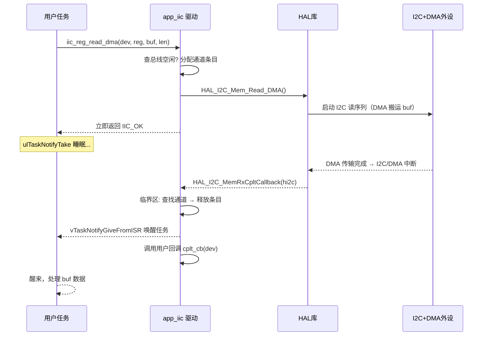

# STM32 I2C DMA 驱动（FreeRTOS 友好）讲解文档

> 对应代码：`IIC/app_iic.h` / `IIC/app_iic.c`

---

## 1. 概述

本驱动对 STM32 **HAL 库的 I2C DMA 功能**进行了二次封装，用于在 **FreeRTOS** 环境下以**异步、非阻塞**的方式读写挂接在 I2C 总线上的外设（传感器、EEPROM 等）。

| 特性 | 说明 |
| --- | --- |
| 传输方式 | 仅 DMA（`HAL_I2C_Mem_Write_DMA` / `HAL_I2C_Mem_Read_DMA`） |
| 阻塞 API | **无**（库内没有任何忙等/死等，任务不会被饿死） |
| 通知机制 | ① 用户回调（ISR 上下文）② FreeRTOS 任务通知 |
| 并发安全 | 通道注册表由临界区保护，任务与中断上下文安全并发 |
| 支持的设备 | 寄存器型（BMI088 / MPU6050 等）、存储器型（AT24CXX 等 EEPROM） |
| 可同时管理的总线数 | `IIC_DMA_CH_NUM`（默认 4 条 I2C 总线） |

---

## 2. 设计思路

### 2.1 为什么用 DMA + 异步

- 轮询（阻塞）方式在 `HAL_I2C_Mem_Read` 里会一直占用 CPU，在 FreeRTOS 任务中调用会**饿死其他低优先级任务**；
- DMA 方式把数据传输交给 DMA 控制器，CPU 只负责发起和收尾，传输期间任务可以继续运行或睡眠；
- 完成通知通过 `vTaskNotifyGiveFromISR` 从中断上下文唤醒任务，任务用 `ulTaskNotifyTake` 睡眠等待——**等待时让出 CPU**，符合 RTOS 使用规范。

### 2.2 分层结构

```
┌─────────────────────────────────────────────┐
│             应用层（用户任务）                  │
│  发起传输 → 睡眠/回调 等待 → 处理数据           │
└──────────────────┬──────────────────────────┘
                   │  iic_*_dma()  回调/任务通知
┌──────────────────▼──────────────────────────┐
│          app_iic.c（本驱动，设备无关）          │
│  ┌─────────────┐  ┌──────────────────────┐   │
│  │ DMA 通道注册表 │  │ HAL 弱回调路由       │   │
│  │ (iic_dma_ch) │  │ MemTxCplt/MemRxCplt │   │
│  │ 临界区保护    │  │ Error → 分发         │   │
│  └──────┬──────┘  └──────────┬───────────┘   │
└─────────┼─────────────────────┼──────────────┘
          │  HAL_I2C_*_DMA()    │ 中断
┌─────────▼─────────────────────▼──────────────┐
│           STM32 HAL 库 + I2C/DMA 外设          │
└───────────────────────────────────────────────┘
```

- **应用层**只与 `iic_dev_t` 设备描述打交道，不关心底层是哪个 I2C、哪条 DMA 通道；
- **驱动层**用一张"通道注册表"把「总线句柄 ↔ 用户回调」对应起来，实现同一驱动管理多条 I2C 总线；
- 驱动不直接接触硬件寄存器，全部基于 HAL 标准接口，方便跨 STM32 系列移植。

---

## 3. 文件与类型说明

### 3.1 文件组成

| 文件 | 作用 |
| --- | --- |
| `app_iic.h` | 所有类型定义、宏、函数声明、使用说明（**所有结构体都在头文件中**） |
| `app_iic.c` | 函数实现、通道注册表、HAL 回调路由 |

### 3.2 核心类型

**① 操作返回值 `iic_status_e`**

```c
IIC_OK      // 成功 / 已启动 / 空闲
IIC_BUSY    // 总线忙 / DMA 传输中 / 通道不足
IIC_TIMEOUT // 超时
IIC_ERROR   // 通信错误（NACK / 硬件错误）
```

**② 设备描述 `iic_dev_t`**（用户唯一的"句柄"）

```c
typedef struct
{
    I2C_HandleTypeDef *hi2c;  // HAL I2C 句柄（&hi2c1 / &hi2c2 ...）
    uint16_t dev_addr;        // 7 位设备地址（不含 R/W 位）
    uint32_t timeout;         // 超时 ms（iic_is_device_ready 使用）
    TaskHandle_t notify_task; // FreeRTOS 任务句柄（传输完成要通知谁）
} iic_dev_t;
```

> `dev_addr` 是 **7 位地址**，而 HAL 函数需要 8 位地址（含 R/W 位），因此内部统一做 `dev_addr << 1`，用户无需关心。

**③ 通道注册表条目 `iic_dma_ch_t`**（内部使用）

```c
typedef struct
{
    I2C_HandleTypeDef *hi2c;  // 总线句柄
    iic_dev_t *dev;           // 当前发起传输的设备
    iic_dma_cb_t cb_tx;       // 发送完成回调
    iic_dma_cb_t cb_rx;       // 接收完成回调
    iic_dma_cb_t cb_err;      // 错误回调
    uint8_t used;             // 占用标志
} iic_dma_ch_t;
```

- 一张静态数组 `iic_dma_ch[IIC_DMA_CH_NUM]`，**每条 I2C 总线占用一个条目**；
- 同一总线上多个设备串行使用（一次只允许一个 DMA 传输），所以按**总线**而不是按**设备**分配通道；
- 传输期间条目被占用，`iic_dma_alloc_ch` 返回该条目，用户代码把回调写入 `cb_tx` / `cb_rx` / `cb_err`。

**④ 回调类型 `iic_dma_cb_t`**

```c
typedef void (*iic_dma_cb_t)(iic_dev_t *dev);
```

回调参数是设备指针，便于一个回调函数服务多个设备（通过 `dev` 区分）。

---

## 4. API 详解

### 4.1 初始化与调试

```c
void iic_dev_init(iic_dev_t *dev, I2C_HandleTypeDef *hi2c,
                  uint16_t dev_addr, uint32_t timeout);
```

- 绑定 HAL 句柄、7 位设备地址、超时时间（传 0 则默认 100ms）；
- 会把 `notify_task` 初始化为 `NULL`（默认只走回调）。

```c
iic_status_e iic_is_device_ready(iic_dev_t *dev);   // 发地址等 ACK，判断设备是否在线
uint32_t      iic_bus_scan(I2C_HandleTypeDef *hi2c); // 扫描 1~127 全部地址，返回位图
```

`iic_bus_scan` 返回值的第 `addr` 位为 1 表示地址 `addr` 上有设备应答，适合上电自检打印。

### 4.2 DMA 异步传输（核心）

| 函数 | 适用设备 | 说明 |
| --- | --- | --- |
| `iic_reg_write_dma(dev, reg, buf, len, cplt_cb, err_cb)` | 寄存器型 | 写连续寄存器，`reg` 为 8 位寄存器地址 |
| `iic_reg_read_dma(dev, reg, buf, len, cplt_cb, err_cb)` | 寄存器型 | 读连续寄存器（如 BMI088 读加速度计 6 字节） |
| `iic_mem_write_dma(dev, addr, add_size, buf, len, cplt_cb, err_cb)` | 存储器型 | 写 EEPROM，地址宽度 `I2C_MEMADD_SIZE_8BIT/16BIT` |
| `iic_mem_read_dma(dev, addr, add_size, buf, len, cplt_cb, err_cb)` | 存储器型 | 读 EEPROM |

所有函数行为一致：

1. 检查总线空闲（`HAL_I2C_GetState != READY` 直接返回 `IIC_BUSY`）；
2. 分配通道条目，写入回调；
3. 调用 `HAL_I2C_Mem_Write_DMA` / `HAL_I2C_Mem_Read_DMA` **立即返回**；
4. DMA 完成后由中断 → HAL 回调 → 本驱动分发。

> ⚠️ `buf` 必须在传输期间保持有效（用 `static` 或全局数组），否则 DMA 会写到悬空内存。

### 4.3 FreeRTOS 集成

```c
void iic_dma_set_notify_task(iic_dev_t *dev, TaskHandle_t task);
```

登记"这次传输完成/出错时要唤醒哪个任务"。通常传 `xTaskGetCurrentTaskHandle()`，登记一次即可，之后每次传输完成 ISR 都会 `vTaskNotifyGiveFromISR` 通知该任务。

### 4.4 状态管理（均非阻塞）

```c
iic_status_e iic_dma_is_busy(iic_dev_t *dev);  // 查询：IIC_OK=空闲 / IIC_BUSY=传输中
iic_status_e iic_dma_abort(iic_dev_t *dev);    // 中止当前传输
```

---

## 5. 两种取数方式（重要）

发起 `iic_*_dma` 后，数据什么时候就绪、怎么拿，取决于你选哪种方式：

### 方式 A：回调驱动（最简单）

```c
static uint8_t accel_raw[6];
static volatile uint8_t imu_flag = 0;

static void imu_done(iic_dev_t *dev)
{
    imu_flag = 1;            // 注意：ISR 上下文！只做置标志/发队列
}

void IMU_Task(void *arg)
{
    iic_dev_t imu;
    iic_dev_init(&imu, &hi2c1, 0x18, 100);

    for (;;)
    {
        if (iic_reg_read_dma(&imu, 0x02, accel_raw, 6, imu_done, NULL) == IIC_OK)
        {
            /* 等 imu_flag 被置位（或干脆下一个周期再判断） */
        }
        vTaskDelay(pdMS_TO_TICKS(5));
    }
}
```

> 回调在 **DMA 中断上下文**执行，绝不能在里面做耗时操作（printf、延时、malloc 等）。

### 方式 B：任务通知（推荐，配合 RTOS）

```c
void IMU_Task(void *arg)
{
    static uint8_t accel_raw[6];
    iic_dev_t imu;
    iic_dev_init(&imu, &hi2c1, 0x18, 100);
    iic_dma_set_notify_task(&imu, xTaskGetCurrentTaskHandle());  // 登记本任务

    for (;;)
    {
        if (iic_reg_read_dma(&imu, 0x02, accel_raw, 6, NULL, NULL) == IIC_OK)
        {
            /* 睡眠等待：最多 50 tick。期间让出 CPU，其他任务照常跑 */
            ulTaskNotifyTake(pdTRUE, 50);
            /* accel_raw 已更新，在这里做数据处理（任务上下文，可放心耗时） */
        }
        vTaskDelay(pdMS_TO_TICKS(5));
    }
}
```

关键点：
- 传输完成 → ISR 里 `vTaskNotifyGiveFromISR` → 任务从 `ulTaskNotifyTake` 返回；
- `ulTaskNotifyTake(pdTRUE, 50)` 带超时，即使传输失败也不会把任务永久挂死；
- 出错时（`HAL_I2C_ErrorCallback`）同样会通知任务，任务可检查状态后重新发起。

---

## 6. 内部工作原理

### 6.1 一次 DMA 读的完整时序



### 6.2 通道注册表为什么需要临界区

- 通道条目的**分配**发生在任务上下文（`iic_*_dma` 函数里）；
- 通道条目的**释放**发生在 DMA 中断上下文（HAL 回调里）；
- 两个上下文可能"同时"访问同一张表，所以：
  - 分配用 `taskENTER_CRITICAL()` / `taskEXIT_CRITICAL()` 包住；
  - 释放也先在临界区内完成"取回调 + 清条目"，**退出临界区后再**调用 `vTaskNotifyGiveFromISR` 和用户回调（ISR 通知函数不应在临界区中调用）。

### 6.3 HAL 弱回调的路由

HAL 默认提供一组 `__weak` 回调（`HAL_I2C_MemTxCpltCallback` 等），本驱动**强定义**了它们并做统一路由：

| HAL 弱回调 | 路由去向 |
| --- | --- |
| `HAL_I2C_MemTxCpltCallback` | 分发发送完成 → 通道的 `cb_tx` + 任务通知 |
| `HAL_I2C_MemRxCpltCallback` | 分发接收完成 → 通道的 `cb_rx` + 任务通知 |
| `HAL_I2C_MasterTxCpltCallback` / `MasterRxCpltCallback` | 保留分发（供非 Mem 方式使用，本库未用） |
| `HAL_I2C_ErrorCallback` | 分发错误 → 通道的 `cb_err` + 任务通知 |

> ⚠️ 如果工程里**其他地方**也重定义了这些回调，会与本驱动冲突，需要合并。

---

## 7. CubeMX 配置要求

1. 开启目标 I2C（如 I2C1），速率 ≤ 400kHz（Fast Mode）；
2. 在 DMA 设置里为 `I2C1_RX` / `I2C1_TX` 各添加一条 DMA 通道；
3. **F1 系列**建议在 NVIC 勾选 **I2C1 event interrupt**，否则 DMA 完成事件可能得不到及时处理，状态卡在 BUSY；
4. FreeRTOS 占用 SysTick 时，若还需要 `HAL_GetTick`（`iic_is_device_ready` 的超时依赖它），在 CubeMX 里给 HAL 单独配一个 TIM 时基；
5. 编译选项中需包含 FreeRTOS 头文件路径。

---

## 8. 常见问题排查

| 现象 | 可能原因 | 处理 |
| --- | --- | --- |
| 一直返回 `IIC_BUSY` | DMA 中断未使能（F1 常见） | NVIC 勾选 I2C 事件中断；检查 DMA 通道是否配置 |
| `iic_dma_is_busy` 永远忙 | 传输完成但 HAL 状态未复位 | 检查是否重定义了 HAL 回调导致本驱动未收到通知 |
| 读回数据全 0 / 错位 | 传感器不支持重复起始（RESTART） | F1 DMA 读可能需要"无 RESTART"模式，或改用轮询确认 |
| 任务永远收不到通知 | `notify_task` 未设置，或传输启动失败 | 确认调用过 `iic_dma_set_notify_task`；检查返回码 |
| 数据偶尔错乱 | `buf` 生命周期/访问冲突 | 用 `static`/全局缓冲；同一总线串行发起传输 |

---

## 9. 与代码的对应关系速查

| 需求 | 用哪个接口 |
| --- | --- |
| 我要读 BMI088 加速度计 6 字节 | `iic_reg_read_dma(&imu, 0x02, accel_raw, 6, cb, NULL)` |
| 我要写 MPU6050 电源管理寄存器 | `iic_reg_write_dma(&imu, 0x6B, &val, 1, cb, NULL)` |
| 我要读 AT24C02 某地址 | `iic_mem_read_dma(&eep, 0x0000, I2C_MEMADD_SIZE_8BIT, buf, 8, cb, NULL)` |
| 我想让任务睡眠等结果 | 登记任务 + `ulTaskNotifyTake(pdTRUE, timeout)` |
| 我想查这次传完没有 | `iic_dma_is_busy(&imu)` |
| 我要中断这次传输 | `iic_dma_abort(&imu)` |
